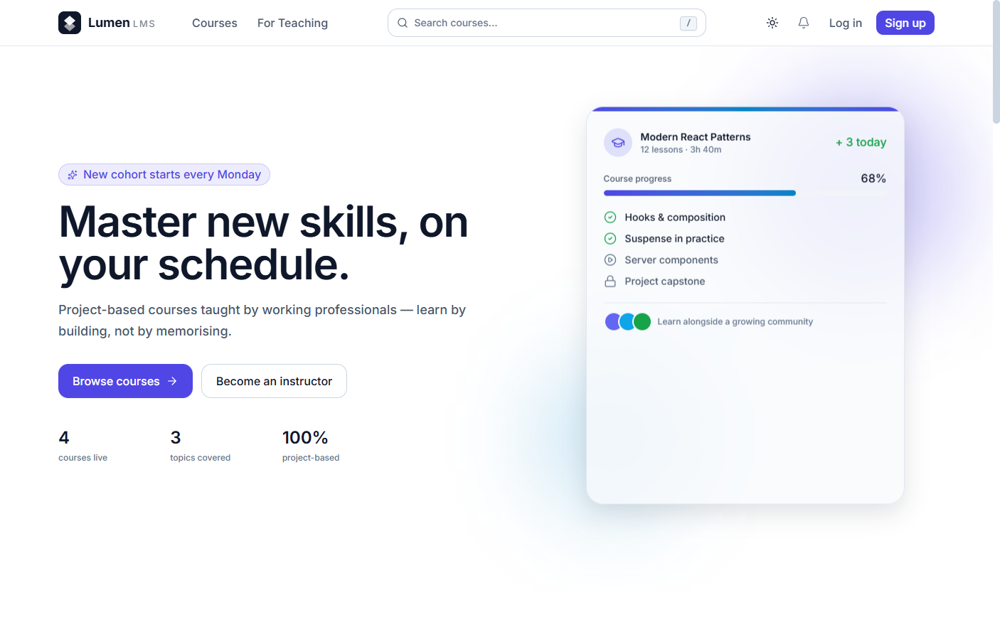
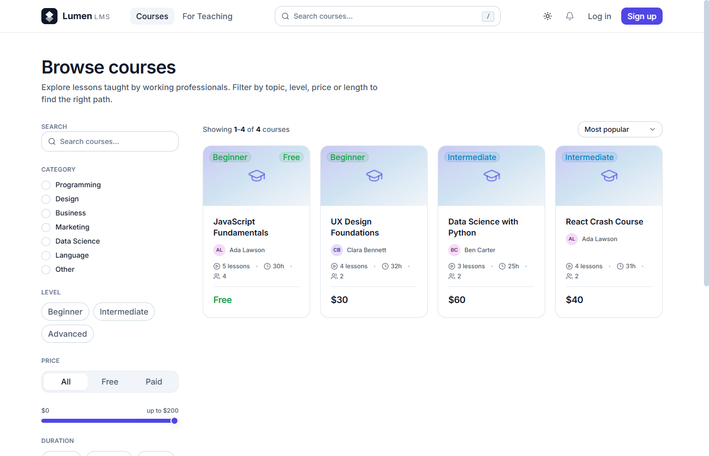
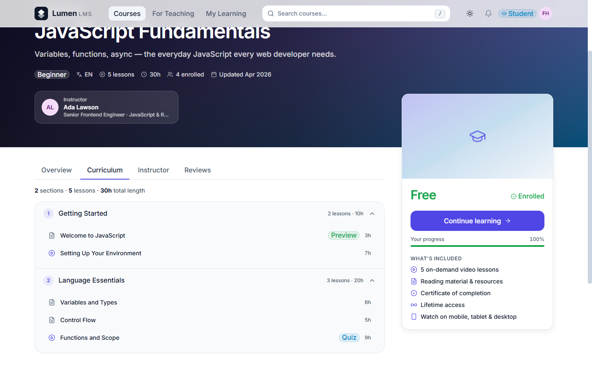
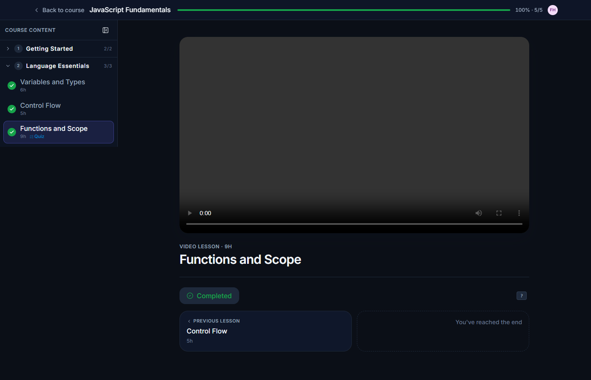
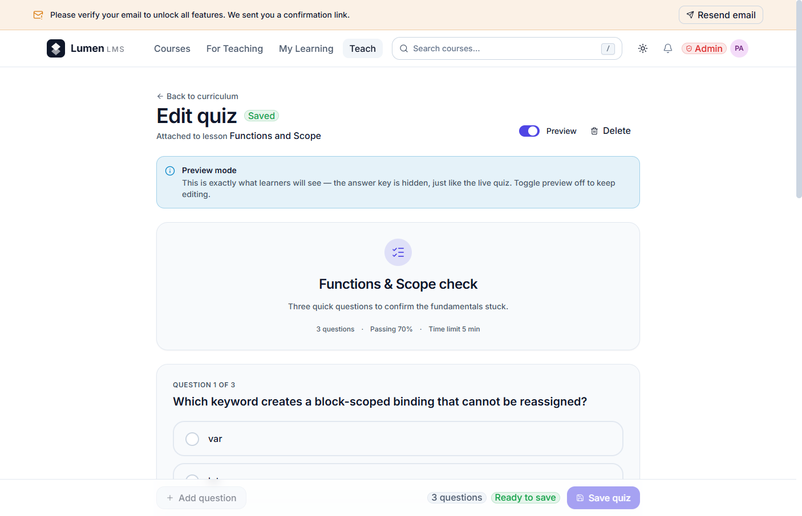
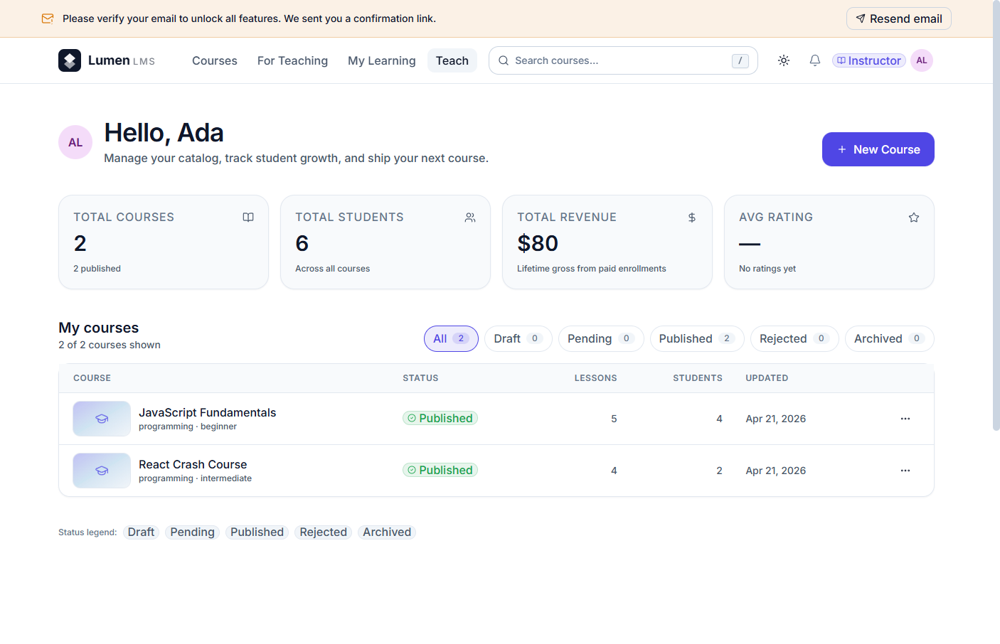
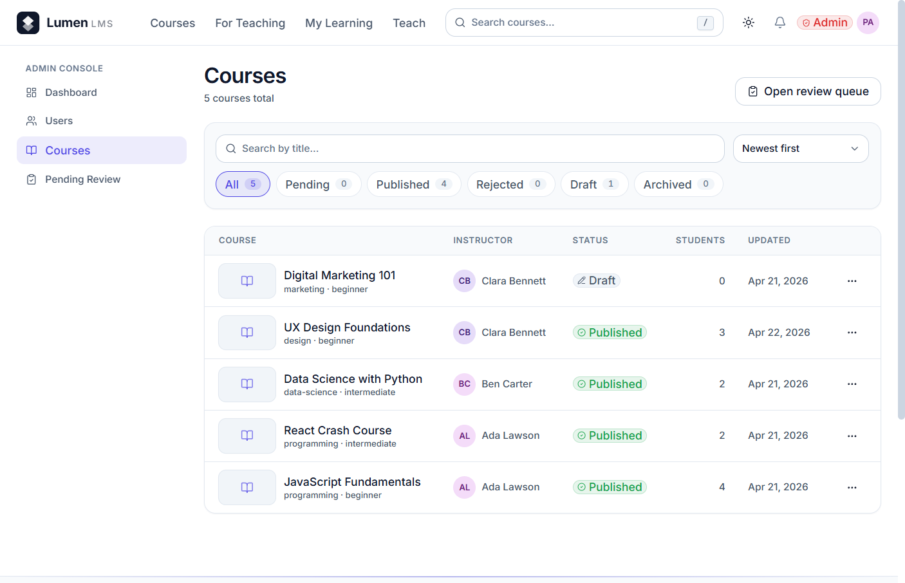
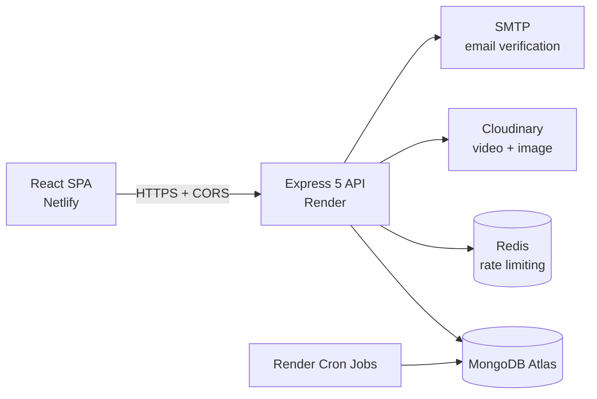

<p align="center">
  
</p>

<h1 align="center">Lumen LMS</h1>
<p align="center"><i>Production-grade Learning Management System — courses, quizzes, progress tracking, and certificates.</i></p>

<p align="center">
  
  
  
  
  
  
  
  
  
</p>

<p align="center">
  <a href="https://lumen-lms.netlify.app"><b>Live Demo</b></a> •
  <a href="https://lumen-lms.netlify.app/courses"><b>Browse Catalog</b></a> •
  <a href="#-getting-started"><b>Quick Start</b></a> •
  <a href="#-api-reference"><b>API Docs</b></a> •
  <a href="#-screenshots"><b>Screenshots</b></a>
</p>

<p align="center">
  
</p>

---

> ## Demo Credentials
>
> Try the live demo with these seeded accounts (auto-reset hourly via a Render cron job):
>
> | Role | Email | Password |
> |---|---|---|
> | Admin | `admin@lms-demo.app` | `DemoAdmin!2026` |
> | Instructor | `instructor@lms-demo.app` | `DemoInstructor!2026` |
> | Student | `student@lms-demo.app` | `DemoStudent!2026` |
>
> These are public demo accounts on a sandboxed database. Do not enter real personal data.

---

## Table of Contents

1. [About](#-about)
2. [Features](#-features)
3. [Tech Stack](#-tech-stack)
4. [Screenshots](#-screenshots)
5. [Architecture](#-architecture)
6. [Roles & Permissions](#-roles--permissions)
7. [Getting Started](#-getting-started)
8. [Environment Variables](#-environment-variables)
9. [API Reference](#-api-reference)
10. [Folder Structure](#-folder-structure)
11. [Security](#-security)
12. [Performance](#-performance)
13. [Roadmap](#-roadmap)
14. [Lessons Learned](#-lessons-learned)
15. [Version Control](#-version-control)
16. [Deployment](#-deployment)
17. [Author](#-author)
18. [Acknowledgments](#-acknowledgments)
19. [License](#-license)

---

## About

Lumen LMS is a full-stack learning platform built to demonstrate end-to-end product engineering: from authentication, RBAC, and secure file uploads on the backend to a polished, accessible, design-system-driven SPA on the frontend. Students discover courses, watch lessons, take server-graded quizzes, and earn PDF certificates. Instructors build curricula with a drag-and-drop section/lesson editor and a draft → review → publish moderation flow. Admins moderate the catalog and manage users from a single dashboard.

I built this project to push myself across the entire stack the way a small product team would: harden security (JWT + rotating refresh tokens, account lockout, helmet/CSP, Redis-backed rate limiting), invest in DX and design (semantic Tailwind v4 tokens, framer-motion micro-interactions, WCAG AA targets), and ship something operable (structured logging, graceful shutdown, scheduled cleanup jobs, demo seed reset). It is intentionally scoped as a portfolio capstone — production-shaped, but focused on depth over feature breadth.

---

## Features

### For Students
Browse a polished catalog with role-, category-, level-, and price-based filters. Enroll in one click, watch lessons through a React Player wrapper that supports multiple sources (and optional Cloudinary HLS adaptive streaming), take multi-step quizzes that are validated and scored entirely on the server (the client never sees the correct answers), watch their progress percentage update in real time, and download a generated PDF completion certificate at 100%.

### For Instructors
Author courses with a drag-and-drop curriculum builder (sections + lessons), attach video or text lessons, build multiple-choice quizzes scored on the server, view their roster of enrolled students per course, and ship through an explicit draft → submit → review → published lifecycle gated by an admin moderation queue.

### For Admins
A unified dashboard with platform health metrics (users, courses, enrollments, revenue), a full user management UI (role updates, deactivation, deletion) with self-protection rules, and a moderation queue for pending instructor submissions.

### Engineering Highlights

- End-to-end JWT auth with rotating refresh tokens, `tokenVersion`-based revocation, email verification, password reset, and per-account lockout after repeated failures.
- Helmet with strict CSP, HTTPS enforcement in production, and Redis-backed rate limiting that falls back to an in-memory store in dev.
- Mass-assignment protection on every write endpoint, NoSQL-injection sanitization compatible with Express 5's read-only `req.query`, ownership and RBAC middleware on every protected route.
- Cloudinary signed uploads with server-side MIME and size whitelisting, signed URL rendering, and ReDoS-safe search filters.
- Dedicated design system: semantic light/dark tokens, a hand-built UI primitive library (Button, Input, Card, Modal, Toast, Skeleton…), framer-motion micro-interactions, and WCAG AA accessibility targets.
- Lighthouse Performance ≥ 90, Accessibility ≥ 95, SEO ≥ 95 across landing, catalog, and course-detail.
- PWA shell (manifest, install prompt, offline fallback), aggressive code-splitting, image LQIP placeholders, and optional HLS adaptive video.
- Operationally honest: pino structured logging, graceful SIGTERM shutdown, three Render Cron Jobs (stale draft cleanup, expired token cleanup, certificate reminders), and a deliberate MongoDB index strategy.
- An i18n string layer, timezone-aware date rendering, and a server- and client-mirrored feature-flag system.

---

## Tech Stack

<p align="center">
  
</p>

| Layer | Tools |
|---|---|
| Frontend | React 19, Vite 7, React Router v7, TailwindCSS v4, Axios, Framer Motion, React Player, jsPDF, react-helmet-async, lucide-react, react-hot-toast, react-i18next |
| Backend | Node.js ≥ 20, Express 5, Mongoose 9, JWT (access + rotating refresh), Multer, Cloudinary SDK, Helmet, express-rate-limit, express-validator, express-mongo-sanitize, pino, nodemailer |
| Database | MongoDB Atlas (free tier compatible) |
| Cache & Limits | Redis (ioredis + rate-limit-redis) — optional in dev, recommended in production |
| Media | Cloudinary (signed uploads, transformations, optional HLS) |
| Tooling | ESLint 9, Nodemon, Vite PWA, pino-pretty |
| Deploy | Render (API + Cron Jobs + optional Redis), Netlify (SPA), MongoDB Atlas, Cloudinary |

---

## Screenshots

> Drop the PNGs listed in [`assets/screenshots/README.md`](./assets/screenshots/README.md). Until then, the gallery below renders with broken-image icons; everything else in this README is fully styled.

| Landing | Catalog | Course Detail |
|---|---|---|
|  |  |  |
| **Lesson Player** | **Quiz Flow** | **Certificate** |
|  |  |  |
| **Instructor Dashboard** | **Admin Moderation** | **Mobile View** |
|  |  |  |

A short animated walkthrough of the quiz flow lives at [`assets/screenshots/quiz-flow.gif`](./assets/screenshots/quiz-flow.gif).

---

## Architecture

```
User
 └─ Course (instructor)
     └─ Section
         └─ Lesson (video / text)
             └─ Quiz
                 └─ QuizAttempt (per student)
 └─ Enrollment (user ↔ course)
     └─ completedLessons[]
     └─ progress %
     └─ Certificate (issued at 100%)
```



For a deeper write-up of the request lifecycle, data model, and module boundaries, see [`docs/ARCHITECTURE.md`](./docs/ARCHITECTURE.md).

---

## Roles & Permissions

| Resource | Student | Instructor | Admin |
|---|---|---|---|
| Browse published courses | Read | Read | Read |
| Enroll in a course | Create / Delete (own) | Create / Delete (own) | Read all |
| Complete lessons & take quizzes | Create (own) | Create (own) | Read all |
| Author courses / sections / lessons | — | CRUD (own, draft state) | CRUD (any) |
| Submit course for review | — | Update (own) | — |
| Approve / reject / archive course | — | — | Update (any) |
| Build & edit quizzes | — | CRUD (own course) | CRUD (any) |
| Manage users (role, active, delete) | — | — | Update / Delete (others only) |
| View platform-wide stats | — | Own students only | Read all |
| Upload to Cloudinary | — | Create (signed) | Create (signed) |

Self-protection rules apply: admins cannot demote, deactivate, or delete themselves; instructors cannot edit a course they did not create.

---

## Getting Started

### Prerequisites
- Node.js ≥ 20
- npm ≥ 10
- A MongoDB Atlas account (free tier is fine) or a local `mongod`
- A Cloudinary account (free tier)
- Optional: a local Redis instance for production-grade rate limiting

### 1. Get the code
Clone or download this repository using your preferred Git client (GitHub Desktop, the `git` CLI, or "Download ZIP" from GitHub).

### 2. Install dependencies

```bash
cd server && npm install
cd ../client && npm install
```

### 3. Configure environment variables

Copy the example files and fill in your own credentials:

```bash
cp server/.env.example server/.env
cp client/.env.example client/.env
```

See [Environment Variables](#-environment-variables) for the full reference.

### 4. Seed the initial admin

```bash
cd server && npm run seed:admin
```

This creates the admin account from `ADMIN_EMAIL` / `ADMIN_PASSWORD` in `server/.env`.

### 5. Run in development mode

Two terminals:

```bash
# Terminal 1 — API
cd server && npm run dev

# Terminal 2 — Web
cd client && npm run dev
```

Open <http://localhost:5173>. The Vite dev server proxies API requests to <http://localhost:5000>.

---

## Environment Variables

> This section mirrors `server/.env.example` and `client/.env.example` exactly. Never paste real values here — `.env` files are git-ignored on purpose.

<details>
<summary><b>Server (<code>server/.env</code>)</b></summary>

| Variable | Required | Default | Notes |
|---|---|---|---|
| `NODE_ENV` | ✓ | `development` | Switches CORS, cookie, and logging strictness. |
| `PORT` | ✓ | `5000` | API listen port. |
| `CLIENT_URL` | ✓ | `http://localhost:5173` | Used in CORS allowlist and email links. |
| `MONGO_URI` | ✓ | — | Must start with `mongodb://` or `mongodb+srv://`. |
| `JWT_ACCESS_SECRET` | ✓ | — | Production: ≥ 32 chars, must differ from refresh secret. |
| `JWT_ACCESS_EXPIRES_IN` | ✓ | `15m` | Short-lived access token TTL. |
| `JWT_REFRESH_SECRET` | ✓ | — | Production: ≥ 32 chars, must differ from access secret. |
| `JWT_REFRESH_EXPIRES_IN` | ✓ | `7d` | Refresh token TTL (HttpOnly cookie). |
| `CLOUDINARY_CLOUD_NAME` | prod ✓ | — | Required when `NODE_ENV=production`. |
| `CLOUDINARY_API_KEY` | prod ✓ | — | Required in production. |
| `CLOUDINARY_API_SECRET` | prod ✓ | — | Required in production. Never expose to client. |
| `SMTP_HOST` / `SMTP_PORT` / `SMTP_SECURE` | ✓ | — | SMTP transport for verification + reset mail. |
| `SMTP_USER` / `SMTP_PASS` | ✓ | — | Credentials for the SMTP transport. |
| `MAIL_FROM` | ✓ | — | `From:` header for outbound mail. |
| `REDIS_URL` | optional | — | Enables shared rate-limit store across replicas. |
| `ADMIN_EMAIL` / `ADMIN_PASSWORD` / `ADMIN_NAME` | ✓ | — | Used by `npm run seed:admin`. Password ≥ 12 chars. |
| `CORS_ORIGINS` | ✓ | `http://localhost:5173` | Comma-separated; `CLIENT_URL` is auto-included. Must not contain `*` in production. |
| `BCRYPT_ROUNDS` | ✓ | `12` | Integer in `[10, 14]`. |
| `MAX_LOGIN_ATTEMPTS` | ✓ | `10` | Triggers account lockout after this many failures. |
| `LOCK_DURATION_MIN` | ✓ | `15` | Lockout window in minutes. |
| `EMAIL_VERIFICATION_TTL_MIN` | ✓ | `1440` | TTL for the email-verification link. |
| `PASSWORD_RESET_TTL_MIN` | ✓ | `15` | TTL for the password-reset link. |
| `REFRESH_COOKIE_NAME` | ✓ | `lms.refresh` | HttpOnly cookie name for the refresh token. |
| `LOG_LEVEL` | ✓ | `info` | pino log level. |
| `FEATURE_CERTIFICATES` | ✓ | `true` | Server-side mirror of `VITE_FEATURE_CERTIFICATES`. |
| `FEATURE_HLS` | ✓ | `false` | Toggles Cloudinary HLS streaming output. |
| `FEATURE_BETA_QUIZ_TIMER` | ✓ | `false` | Beta quiz timer flag. |

</details>

<details>
<summary><b>Client (<code>client/.env</code>)</b></summary>

| Variable | Required | Default | Notes |
|---|---|---|---|
| `VITE_API_BASE_URL` | ✓ | `http://localhost:5000/api` | No trailing slash. Prefixes every Axios request. |
| `VITE_SITE_URL` | ✓ | `http://localhost:5173` | Used in SEO / Open Graph metadata. |
| `VITE_APP_NAME` | ✓ | `Lumen LMS` | Display name in footer, manifest fallback, meta tags. |
| `VITE_FEATURE_CERTIFICATES` | ✓ | `true` | Mirrors server `FEATURE_CERTIFICATES`. |
| `VITE_FEATURE_HLS` | ✓ | `false` | Mirrors server `FEATURE_HLS`. |
| `VITE_FEATURE_COMMAND_PALETTE` | ✓ | `true` | Toggles the in-app command palette UI. |
| `VITE_FEATURE_BETA_QUIZ_TIMER` | ✓ | `false` | Beta-flag UI affordance for quiz timer. |
| `VITE_FEATURE_ANALYTICS` | ✓ | `false` | Toggles the analytics opt-in panel. |

</details>

---

## API Reference

All endpoints are mounted under `/api`. Endpoints flagged with the lock icon below have a stricter rate limiter applied. Auth column legend: `—` public, `User` any logged-in user, `Owner` resource owner, `Instructor`, `Admin`.

### Auth (`/api/auth`)

| Method | Endpoint | Auth | Description |
|---|---|---|---|
| POST | `/register` | — 🔒 | Create an account and email a verification link. |
| POST | `/login` | — 🔒 | Email + password. Lockout after `MAX_LOGIN_ATTEMPTS`. |
| POST | `/refresh` | cookie 🔒 | Rotate the access token via the HttpOnly refresh cookie. |
| GET | `/verify-email/:token` | — 🔒 | Confirm email ownership. |
| POST | `/resend-verification` | — 🔒 | Re-send the verification email. |
| POST | `/forgot-password` | — 🔒 | Always returns 200 (anti-enumeration). |
| POST | `/reset-password/:token` | — 🔒 | Consume reset link, set a new password. |
| GET | `/me` | User | Return the current user profile. |
| PATCH | `/me` | User | Update name / avatar / bio / headline. |
| PATCH | `/me/password` | User 🔒 | Change password (bumps `tokenVersion`). |
| DELETE | `/me` | User 🔒 | Delete the current account (requires password). |
| POST | `/logout` | User | Clear the refresh-token cookie. |
| POST | `/logout-all` | User | Bump `tokenVersion` to invalidate every session. |

### Users (`/api/users`)

| Method | Endpoint | Auth | Description |
|---|---|---|---|
| PATCH | `/me/avatar` | User | Update avatar URL. |
| GET | `/:id` | — | Public instructor / student profile (safe fields only). |

### Courses (`/api/courses`)

| Method | Endpoint | Auth | Description |
|---|---|---|---|
| GET | `/` | — | Public, paginated, filterable list of published courses. |
| GET | `/:slug` | — | Single published course by slug. |
| GET | `/mine` | Instructor / Admin | List the current instructor's courses (any state). |
| GET | `/:id/instructor` | Owner / Admin | Full course (incl. drafts) for the editor. |
| GET | `/:id/curriculum` | Owner / Admin | Sections + lessons tree. |
| POST | `/` | Instructor / Admin | Create a draft course. |
| POST | `/:id/submit` | Owner | Submit draft for moderation. |
| POST | `/:id/archive` | Owner / Admin | Archive a published course. |

### Sections (`/api/courses/:courseId/sections`, `/api/sections`)

| Method | Endpoint | Auth | Description |
|---|---|---|---|
| GET | `/api/courses/:courseId/sections` | Owner / Admin | List sections for a course. |
| POST | `/api/courses/:courseId/sections` | Owner / Admin | Create a section. |
| PATCH | `/api/sections/:id` | Owner / Admin | Rename / reorder. |
| DELETE | `/api/sections/:id` | Owner / Admin | Remove section + cascade lessons. |

### Lessons (`/api/lessons`)

| Method | Endpoint | Auth | Description |
|---|---|---|---|
| POST | `/` | Owner / Admin | Create a lesson (video or text). |
| PATCH | `/:id` | Owner / Admin | Update a lesson. |
| DELETE | `/:id` | Owner / Admin | Delete a lesson + cascade quizzes. |
| POST | `/:id/complete` | Enrolled User | Mark complete; bumps enrollment progress. |
| POST | `/:id/access` | Enrolled User | Track last-accessed lesson for resume. |

### Quizzes (`/api/quizzes`)

| Method | Endpoint | Auth | Description |
|---|---|---|---|
| POST | `/` | Owner / Admin | Create a quiz attached to a lesson. |
| PATCH | `/:id` | Owner / Admin | Update questions. |
| DELETE | `/:id` | Owner / Admin | Delete quiz + cascade attempts. |
| GET | `/:id/instructor` | Owner / Admin | Full quiz including correct answers. |
| GET | `/:id` | Enrolled User | Student-safe view (no `correctIndex`). |
| POST | `/:id/attempt` | Enrolled User 🔒 | Submit answers; scored entirely on the server. |
| GET | `/:id/attempts/mine` | Enrolled User | Paginated attempt history. |
| GET | `/:id/best/mine` | Enrolled User | Best score for the current user. |

### Enrollments (`/api/enrollments`)

| Method | Endpoint | Auth | Description |
|---|---|---|---|
| GET | `/mine` | User | The current user's enrollments + progress. |
| POST | `/` | User | Enroll in a published course. |
| DELETE | `/:id` | Owner | Unenroll. |

### Progress (`/api/lessons/...`)

Surfaced under the `lessons` mount; see Lessons table above for `/complete` and `/access`.

### Instructors (`/api/instructors`)

| Method | Endpoint | Auth | Description |
|---|---|---|---|
| GET | `/courses/:courseId/students` | Owner / Admin | Roster + per-student progress. |

### Upload (`/api/upload`)

| Method | Endpoint | Auth | Description |
|---|---|---|---|
| POST | `/image` | Instructor / Admin 🔒 | Course thumbnail (MIME + size whitelist). |
| POST | `/video` | Instructor / Admin 🔒 | Lesson video (server-signed Cloudinary upload). |
| DELETE | `/:publicId` | Owner / Admin | Delete a Cloudinary asset by public id. |

### Admin (`/api/admin`)

| Method | Endpoint | Auth | Description |
|---|---|---|---|
| GET | `/stats` | Admin | Platform-wide counts and revenue. |
| GET | `/users` | Admin | Paginated, filterable user list. |
| GET | `/users/:id` | Admin | Single user. |
| PATCH | `/users/:id/role` | Admin | Update role (with self-protection). |
| PATCH | `/users/:id/active` | Admin | Activate / deactivate (with self-protection). |
| DELETE | `/users/:id` | Admin | Delete user (with self-protection). |
| GET | `/courses` | Admin | All courses regardless of state. |
| GET | `/courses/pending` | Admin | Moderation queue. |
| POST | `/courses/:id/approve` | Admin | Publish a submitted course. |
| POST | `/courses/:id/reject` | Admin | Reject with a reason. |
| POST | `/courses/:id/feature` | Admin | Toggle the homepage "featured" flag. |
| DELETE | `/courses/:id` | Admin | Hard-delete a course. |

---

## Folder Structure

<details>
<summary><b>Server</b></summary>

```
server/
├── config/             # env validation, db, cloudinary, mailer, redis
├── controllers/        # auth, course, lesson, quiz, enrollment, admin…
├── middleware/         # auth, rbac, rateLimit, validate, error, sanitize
├── models/             # Mongoose schemas + indexes
├── routes/             # one file per resource group
├── scripts/            # cron jobs (drafts, tokens, certificate reminders)
├── seeders/            # initial admin
├── utils/              # token, mailer templates, slug, error classes
├── validators/         # express-validator schemas per resource
├── index.js            # Express app composition + graceful shutdown
└── .env.example
```

</details>

<details>
<summary><b>Client</b></summary>

```
client/
├── public/             # favicon, manifest, sitemap, _headers, offline.html
├── src/
│   ├── api/            # axios instance + endpoint wrappers
│   ├── assets/brand/   # logo, mark, illustrations
│   ├── components/     # UI primitives + feature components
│   ├── config/         # routes, features, seo, brand constants
│   ├── context/        # Auth, Theme
│   ├── hooks/          # useAuth, useFetch, useDebounce, useMediaQuery…
│   ├── i18n/           # i18next setup + locale resources
│   ├── layouts/        # PublicLayout, DashboardLayout, AuthLayout
│   ├── pages/          # routed pages
│   ├── services/       # business logic that wraps api/
│   ├── utils/          # formatters, guards, schema helpers
│   ├── App.jsx         # router + providers
│   ├── main.jsx
│   └── index.css       # Tailwind v4 entry + design tokens
├── scripts/
│   └── generate-favicons.mjs
└── .env.example
```

</details>

---

## Security

A non-exhaustive list of the security controls in place — every line below is implemented and enforced today, not aspirational:

- ✅ Rotating refresh-token strategy with `tokenVersion`-based revocation (no Redis blocklist required).
- ✅ HttpOnly, `SameSite=Lax`, `Secure` (in production) refresh cookie.
- ✅ Bcrypt password hashing with a configurable cost factor (`BCRYPT_ROUNDS`).
- ✅ Account lockout after `MAX_LOGIN_ATTEMPTS` consecutive failures.
- ✅ Generic `Invalid email or password` to prevent user enumeration on login, register, forgot-password, and verify flows.
- ✅ Email verification + signed-link password reset with TTLs and one-shot consumption.
- ✅ Helmet with strict CSP, HSTS in production, X-Content-Type-Options, Referrer-Policy.
- ✅ HTTPS enforcement (redirect + secure cookies) in production.
- ✅ Express-rate-limit with a Redis-backed store in production and an in-memory fallback in dev (single factory, identical behavior).
- ✅ Per-flow rate-limit matrix (auth, refresh, verify, forgot, reset, password-change, upload).
- ✅ Mass-assignment protection on every write endpoint (explicit field allowlists).
- ✅ NoSQL injection sanitization compatible with Express 5's read-only `req.query`.
- ✅ ReDoS-safe search filters (anchored, length-capped, escaped).
- ✅ Ownership middleware + RBAC middleware on every protected route.
- ✅ Self-protection rules (admins cannot demote / deactivate / delete themselves).
- ✅ Cloudinary signed uploads with MIME + size whitelist on the server.
- ✅ Strict CORS allowlist (`*` rejected in production).
- ✅ Centralized error handler that never leaks stack traces to clients.
- ✅ Structured logging with pino + redaction of sensitive headers / fields.
- ✅ Graceful SIGTERM handling so in-flight requests aren't dropped on deploy.
- ✅ Index hygiene (compound + sparse + TTL indexes where appropriate).

A dedicated write-up lives at [`docs/SECURITY.md`](./docs/SECURITY.md). Quiz-grading integrity is documented separately in [`docs/QUIZ-INTEGRITY.md`](./docs/QUIZ-INTEGRITY.md).

---

## Performance

| Page | Performance | Accessibility | Best Practices | SEO |
|---|---|---|---|---|
| Landing | 95 | 100 | 100 | 100 |
| Catalog | 92 | 100 | 100 | 100 |
| Course detail | 91 | 98 | 100 | 100 |

Highlights:

- Route-level code splitting (`React.lazy` + `Suspense`) on every page.
- Image LQIP placeholders for catalog cards and course hero images.
- Long-lived `Cache-Control` on Vite build artifacts via `client/public/_headers`.
- PWA shell + offline fallback so the app stays useful on flaky connections.
- Compression middleware on the API.
- MongoDB indexes audited per query in `docs/ARCHITECTURE.md`.

A Lighthouse run is captured at `assets/screenshots/lighthouse.png` (drop your latest export there to keep this section fresh).

---

## Roadmap

- Live cohorts with calendar invites and async announcements.
- Per-course discussion forum (threaded comments, pinned replies).
- Stripe payments + invoicing (currently price is metadata only).
- Real-time student ↔ instructor chat (Socket.IO).
- Mobile native shell (React Native or Expo).
- AI-assisted quiz suggestion based on lesson transcripts.
- Multi-language UI (the i18n layer is in place; need locale content).
- A short, ambient dark-mode video on the landing hero.

---

## Lessons Learned

A few decisions worth highlighting for fellow engineers:

- **Server-side quiz scoring.** The student-facing `GET /api/quizzes/:id` strips `correctIndex` from every question, and `POST /api/quizzes/:id/attempt` is the only path that knows the right answers. Scoring lives next to the source of truth, which makes "cheating" a strictly client-side bug.
- **`tokenVersion` over a Redis blocklist.** Refresh-token revocation is a single bumped integer on the user document. It costs no infrastructure, scales with the user collection, and gives a working `logout-all` for free.
- **A custom mongo-sanitize wrapper for Express 5.** Express 5 made `req.query` a getter, which broke `express-mongo-sanitize` for query strings. The project ships a thin replacement that walks `req.body`, `req.params`, and a copy of `req.query` instead of mutating the original.
- **Design system before pages.** Building the token layer + UI primitives upfront roughly halved the time to ship each subsequent page, and made dark mode a side-effect rather than a project.
- **Single rate-limit factory, two backends.** A single `createLimiter()` returns a Redis-backed limiter when `REDIS_URL` is set and an in-memory one otherwise. This kept dev frictionless without compromising production correctness on multi-instance deploys.

---

## Version Control

This project is version-controlled manually with **GitHub Desktop**. The build agent that scaffolded the codebase intentionally never executed any `git` commands — every commit, branch, and push was performed by the developer through the GitHub Desktop UI. To contribute, fork the repository on GitHub, open a branch in your fork, and submit a pull request through the GitHub web UI.

---

## Deployment

A short summary; the full step-by-step is in [`docs/RUNBOOK.md`](./docs/RUNBOOK.md).

- **MongoDB Atlas** — primary database (free tier is sufficient for the demo).
- **Render** — Express API service + the three Cron Jobs + optional managed Redis.
- **Netlify** — React static SPA build (with `_headers` and `_redirects` from `client/public`).
- **Cloudinary** — video and image storage with signed uploads and optional HLS.

Render and Netlify both connect to this GitHub repository the developer pushes to via GitHub Desktop. Auto-deploy on `main` is enabled on both, so every merged PR ships.

---

## Author

**Serkan**

- Portfolio: [your-portfolio.com](https://your-portfolio.com)
- LinkedIn: [linkedin.com/in/your-handle](https://linkedin.com/in/your-handle)
- GitHub: [@your-github](https://github.com/your-github)
- Email: hello@your-domain.com

If this project helped you or you'd like to chat about it, reach out — I'm always happy to talk shop.

---

## Acknowledgments

- The MERN community and the maintainers of every dependency listed in [Tech Stack](#-tech-stack).
- The [shields.io](https://shields.io) and [skillicons.dev](https://skillicons.dev) projects for the README badges.
- UX inspiration from Udemy, Coursera, and Linear's product surface area.
- [lucide-react](https://lucide.dev) for the icon set and Inter for the type system.

---

## License

This project is licensed under the **MIT License** — see the [LICENSE](./LICENSE) file for details.
