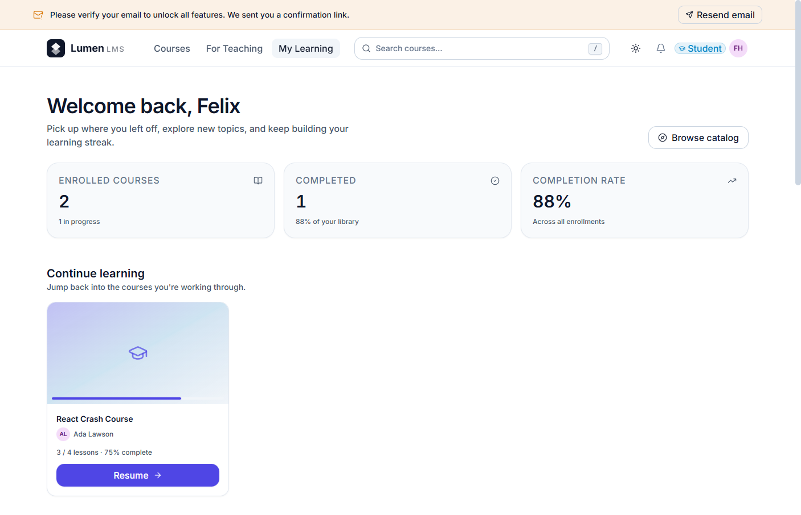
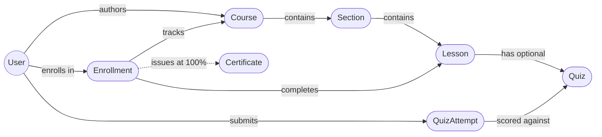
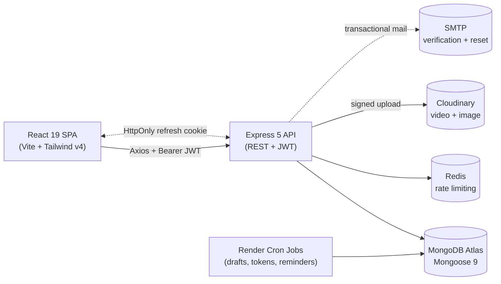

# 🎓 Lumen LMS

A full-stack **Learning Management System** built with the **MERN** stack (MongoDB, Express 5, React 19, Node.js ≥ 20). Students discover courses, watch lessons, take server-graded quizzes, and earn PDF certificates. Instructors author curricula through a draft → review → publish workflow, and admins moderate the catalog from a unified dashboard. Hardened with rotating JWT refresh tokens, Redis-backed rate limiting, RBAC, signed Cloudinary uploads, and a semantic Tailwind v4 design system.

[](https://serkanbayraktar.com/)
[](https://github.com/Serkanbyx)
[](./LICENSE)
[](https://nodejs.org)
[](https://react.dev)
[](https://expressjs.com)
[](https://www.mongodb.com/atlas)
[](https://tailwindcss.com)

---

## Features

- **Role-Based Access Control** — Three first-class roles (Student, Instructor, Admin) with explicit ownership and self-protection rules on every protected route.
- **Authoring Workflow** — Drag-and-drop section/lesson editor with an explicit **draft → submit → review → published** lifecycle gated by an admin moderation queue.
- **Server-Graded Quizzes** — Multiple-choice questions with `correctIndex` stripped from the student-facing payload; scoring happens entirely on the server, so cheating becomes a strictly client-side bug.
- **Progress Tracking & Certificates** — Per-lesson completion bumps an enrollment progress percentage, and a generated **PDF certificate** is unlocked at 100%.
- **Video & Media Pipeline** — Cloudinary signed uploads with server-side MIME and size whitelisting, plus optional Cloudinary HLS adaptive streaming and a React Player wrapper.
- **Hardened Authentication** — JWT access + rotating refresh tokens, `tokenVersion`-based revocation, account lockout, email verification, and one-shot password reset links.
- **Production Ops** — Structured pino logging, graceful SIGTERM shutdown, three Render Cron Jobs (stale draft cleanup, expired token cleanup, certificate reminders), and Redis-backed shared rate limiting.
- **Design System First** — Semantic light/dark Tailwind v4 tokens, a hand-built UI primitive library (Button, Input, Card, Modal, Toast, Skeleton…), Framer Motion micro-interactions, and WCAG AA accessibility targets.
- **PWA & Performance** — Installable PWA shell with offline fallback, route-level code splitting, image LQIP placeholders, compression, and Lighthouse scores ≥ 90 on Performance / ≥ 95 on Accessibility & SEO.
- **Internationalization Ready** — i18next layer for the entire UI string surface and timezone-aware date rendering.
- **Interactive API Docs** — Swagger UI at `/api-docs` and the raw OpenAPI 3.0 spec at `/api-docs.json`.

---

## Live Demo

[🚀 View Live Demo](https://lms-mernn.netlify.app/)

---

## Screenshots

All screenshots are captured from the [live deployment](https://lms-mernn.netlify.app/) running against the seeded demo dataset.

<table>
  <tr>
    <td align="center" width="33%">
      <a href="./assets/screenshots/landing.png"></a>
      <sub><b>Landing</b><br/>Marketing hero & feature pitch</sub>
    </td>
    <td align="center" width="33%">
      <a href="./assets/screenshots/catalog.png"></a>
      <sub><b>Catalog</b><br/>Filterable course discovery</sub>
    </td>
    <td align="center" width="33%">
      <a href="./assets/screenshots/course-detail.png"></a>
      <sub><b>Course detail</b><br/>Curriculum tree & enrollment</sub>
    </td>
  </tr>
  <tr>
    <td align="center" width="33%">
      <a href="./assets/screenshots/lesson-player.png"></a>
      <sub><b>Lesson player</b><br/>Video + progress tracking</sub>
    </td>
    <td align="center" width="33%">
      <a href="./assets/screenshots/quiz.png"></a>
      <sub><b>Quiz</b><br/>Server-scored multi-question flow</sub>
    </td>
    <td align="center" width="33%">
      <a href="./assets/screenshots/certificate.png"></a>
      <sub><b>Certificate</b><br/>Auto-generated PDF on 100%</sub>
    </td>
  </tr>
  <tr>
    <td align="center" width="33%">
      <a href="./assets/screenshots/student-dashboard.png"></a>
      <sub><b>Student dashboard</b><br/>Continue learning & enrollments</sub>
    </td>
    <td align="center" width="33%">
      <a href="./assets/screenshots/instructor-dashboard.png"></a>
      <sub><b>Instructor dashboard</b><br/>Revenue, students & course status</sub>
    </td>
    <td align="center" width="33%">
      <a href="./assets/screenshots/admin-moderation.png"></a>
      <sub><b>Admin console</b><br/>Moderation queue & course directory</sub>
    </td>
  </tr>
</table>

> Bonus operator views — the platform overview (`admin-dashboard.png`) and the user directory (`admin-users.png`) — also live in `assets/screenshots/` for reference.

---

## Architecture

A high-level visual map of the system. Both diagrams render natively on GitHub thanks to Mermaid support.

### Domain Model

How the core MongoDB collections relate to each other and how progress is tracked across enrollments.



### Request Lifecycle

How a single browser action travels through the stack — from the React SPA on Netlify to the Express API on Render and out to MongoDB, Redis, Cloudinary, and SMTP.



For a deeper write-up of module boundaries and trade-offs, see [`docs/ARCHITECTURE.md`](./docs/ARCHITECTURE.md).

---

## Technologies

### Frontend

- **React 19**: Modern UI library with hooks, context, and concurrent rendering
- **Vite 7**: Lightning-fast build tool and dev server with HMR
- **React Router v7**: File-agnostic data router for nested routes and layouts
- **Tailwind CSS v4**: Utility-first CSS framework with semantic design tokens
- **Framer Motion**: Production-ready animations and micro-interactions
- **Axios**: Promise-based HTTP client with interceptors for auth refresh
- **React Player**: Pluggable video player with multi-source and HLS support
- **jsPDF**: Client-side PDF generation for completion certificates
- **react-i18next**: Type-safe internationalization layer
- **react-hot-toast**: Lightweight, accessible toast notifications
- **lucide-react**: Beautiful, tree-shakable SVG icon set
- **react-helmet-async**: SEO and Open Graph metadata management
- **vite-plugin-pwa**: Installable PWA shell with offline fallback

### Backend

- **Node.js ≥ 20**: Modern, stable JavaScript runtime
- **Express 5**: Minimal and flexible web application framework
- **MongoDB (Mongoose 9)**: NoSQL database with elegant object modeling
- **JWT (jsonwebtoken)**: Stateless auth with rotating refresh tokens and `tokenVersion` revocation
- **bcryptjs**: Password hashing with a configurable cost factor
- **Helmet**: HTTP security headers with a strict Content Security Policy
- **express-rate-limit + rate-limit-redis**: Per-flow rate limiting with a Redis-backed store
- **express-validator**: Declarative request validation and sanitization
- **express-mongo-sanitize**: NoSQL injection protection (Express 5 compatible wrapper)
- **Multer + Cloudinary SDK**: Streaming file uploads with server-signed Cloudinary delivery
- **Nodemailer**: SMTP transport for verification and password-reset emails
- **pino + pino-http**: Structured logging with sensitive-field redaction
- **swagger-jsdoc + swagger-ui-express**: OpenAPI 3.0 spec and live `/api-docs` UI
- **ioredis**: Redis client for the shared rate-limit store
- **slugify**: URL-safe slug generation for course routes

---

## Installation

### Prerequisites

- **Node.js** v20+ and **npm** v10+
- **MongoDB** — MongoDB Atlas (free tier) or a local `mongod` instance
- **Cloudinary** account (free tier) for media uploads
- **SMTP** transport (e.g., a free Mailtrap/Brevo account) for verification mail
- **Redis** — optional in development, recommended in production (e.g., Render Key Value)

### Local Development

**1. Clone the repository:**

```bash
git clone https://github.com/Serkanbyx/lumen-lms.git
cd lumen-lms
```

**2. Set up environment variables:**

```bash
cp server/.env.example server/.env
cp client/.env.example client/.env
```

**server/.env**

```env
NODE_ENV=development
PORT=5000
CLIENT_URL=http://localhost:5173
CORS_ORIGINS=http://localhost:5173

MONGO_URI=your_mongodb_connection_string

JWT_ACCESS_SECRET=your_access_secret_min_32_chars
JWT_ACCESS_EXPIRES_IN=15m
JWT_REFRESH_SECRET=your_refresh_secret_min_32_chars_different
JWT_REFRESH_EXPIRES_IN=7d
REFRESH_COOKIE_NAME=lms.refresh

CLOUDINARY_CLOUD_NAME=your_cloud_name
CLOUDINARY_API_KEY=your_api_key
CLOUDINARY_API_SECRET=your_api_secret

SMTP_HOST=smtp.example.com
SMTP_PORT=587
SMTP_SECURE=false
SMTP_USER=your_smtp_user
SMTP_PASS=your_smtp_password
MAIL_FROM="Lumen LMS <no-reply@example.com>"

REDIS_URL=

ADMIN_EMAIL=admin@example.com
ADMIN_PASSWORD=ChangeMe!2026Strong
ADMIN_NAME=Site Admin

BCRYPT_ROUNDS=12
MAX_LOGIN_ATTEMPTS=10
LOCK_DURATION_MIN=15
EMAIL_VERIFICATION_TTL_MIN=1440
PASSWORD_RESET_TTL_MIN=15

LOG_LEVEL=info
FEATURE_CERTIFICATES=true
FEATURE_HLS=false
FEATURE_BETA_QUIZ_TIMER=false
```

**client/.env**

```env
VITE_API_BASE_URL=http://localhost:5000/api
VITE_SITE_URL=http://localhost:5173
VITE_APP_NAME=Lumen LMS

VITE_FEATURE_CERTIFICATES=true
VITE_FEATURE_HLS=false
VITE_FEATURE_COMMAND_PALETTE=true
VITE_FEATURE_BETA_QUIZ_TIMER=false
VITE_FEATURE_ANALYTICS=false
```

**3. Install dependencies:**

```bash
cd server && npm install
cd ../client && npm install
```

**4. Seed the initial admin (and optionally the demo data):**

```bash
cd server
npm run seed:admin
npm run seed:demo
```

**5. Run the application:**

```bash
# Terminal 1 — Backend (http://localhost:5000)
cd server && npm run dev

# Terminal 2 — Frontend (http://localhost:5173)
cd client && npm run dev
```

Open <http://localhost:5173>. The Vite dev server proxies API requests to the Express server on port 5000. Interactive API docs live at <http://localhost:5000/api-docs>.

---

## Usage

1. **Register** a new account at `/auth/register` and confirm the email-verification link sent via SMTP.
2. **Log in** at `/auth/login`. JWT access tokens are stored in memory; the rotating refresh token is set as an HttpOnly cookie automatically.
3. **Browse the catalog** at `/courses` and filter by category, level, or price.
4. **Enroll** in a course in one click; the lesson player and curriculum tree become immediately available.
5. **Watch lessons** and mark them complete — your enrollment progress percentage updates in real time.
6. **Take quizzes** at the end of qualifying lessons; the server returns your score and attempt history.
7. **Download your certificate** at `/dashboard/certificates` once you reach 100% progress.
8. **Instructors** can request the role from an admin, then author courses at `/instructor/courses` and submit them for moderation.
9. **Admins** moderate the catalog and manage users from `/admin`.
10. **Log out** from the user menu, or use **Log out everywhere** to bump `tokenVersion` and invalidate every session.

---

## How It Works?

### Authentication Flow

Authentication is a two-token system. A short-lived access token (15 min) is sent in the `Authorization: Bearer` header and never stored in `localStorage`. A long-lived refresh token (7 days) lives in an HttpOnly, `SameSite=Lax`, `Secure` (in production) cookie. An Axios response interceptor transparently rotates the access token on 401:

```js
api.interceptors.response.use(
  (res) => res,
  async (err) => {
    const original = err.config;
    if (err.response?.status === 401 && !original._retry) {
      original._retry = true;
      await api.post('/auth/refresh');
      return api(original);
    }
    return Promise.reject(err);
  }
);
```

Server-side, `tokenVersion` on the user document is the single source of truth for revocation: any `logout-all` or password change bumps it, and every refresh validates the embedded version against the database.

### Authoring & Moderation Lifecycle

Courses move through an explicit state machine — `draft → submitted → published → archived` — and only the admin can flip the gate from `submitted` to `published`. Instructors edit drafts with a section/lesson tree editor; the catalog only ever exposes `published` documents to the public route.

### Server-Graded Quiz Integrity

`GET /api/quizzes/:id` (the student-facing endpoint) strips `correctIndex` from every question. `POST /api/quizzes/:id/attempt` is the **only** path that knows the right answers; the client submits answer indices and receives a score plus per-question correctness flags. This means cheating is a strictly client-side bug, and the integrity of grading lives next to the source of truth.

### Rate Limiting Strategy

A single `createLimiter()` factory returns a Redis-backed limiter when `REDIS_URL` is set and an in-memory one otherwise — identical interface, transparent backend swap. A per-flow matrix applies stricter limits to login, refresh, verify, forgot, reset, password-change, and upload routes.

### Cloudinary Signed Uploads

Browsers never receive the Cloudinary API secret. The server signs upload presets with a server-side MIME and size whitelist (`image/jpeg`, `image/png`, `image/webp` for thumbnails; `video/mp4`, `video/webm` for lessons), streams the multipart body via Multer, and returns the resulting `secure_url` and `public_id` for persistence on the lesson document.

---

## API Endpoints

All endpoints are mounted under `/api`. Auth column legend: `—` public, `User` any logged-in user, `Owner` resource owner, `Instructor` / `Admin` role gate. Endpoints flagged with the lock icon (🔒) have a stricter rate limiter applied.

### Auth (`/api/auth`)

| Method | Endpoint | Auth | Description |
| --- | --- | --- | --- |
| POST | `/register` | — 🔒 | Create an account and email a verification link |
| POST | `/login` | — 🔒 | Email + password; lockout after `MAX_LOGIN_ATTEMPTS` |
| POST | `/refresh` | cookie 🔒 | Rotate the access token via the HttpOnly refresh cookie |
| GET | `/verify-email/:token` | — 🔒 | Confirm email ownership |
| POST | `/resend-verification` | — 🔒 | Re-send the verification email |
| POST | `/forgot-password` | — 🔒 | Always returns 200 (anti-enumeration) |
| POST | `/reset-password/:token` | — 🔒 | Consume reset link and set a new password |
| GET | `/me` | User | Return the current user profile |
| PATCH | `/me` | User | Update name, avatar, bio, headline |
| PATCH | `/me/password` | User 🔒 | Change password (bumps `tokenVersion`) |
| DELETE | `/me` | User 🔒 | Delete the current account (requires password) |
| POST | `/logout` | User | Clear the refresh-token cookie |
| POST | `/logout-all` | User | Bump `tokenVersion` to invalidate every session |

### Users (`/api/users`)

| Method | Endpoint | Auth | Description |
| --- | --- | --- | --- |
| PATCH | `/me/avatar` | User | Update avatar URL |
| GET | `/:id` | — | Public instructor / student profile (safe fields only) |

### Courses (`/api/courses`)

| Method | Endpoint | Auth | Description |
| --- | --- | --- | --- |
| GET | `/` | — | Public, paginated, filterable list of published courses |
| GET | `/:slug` | — | Single published course by slug |
| GET | `/mine` | Instructor / Admin | List the current instructor's courses (any state) |
| GET | `/:id/instructor` | Owner / Admin | Full course (incl. drafts) for the editor |
| GET | `/:id/curriculum` | Owner / Admin | Sections + lessons tree |
| POST | `/` | Instructor / Admin | Create a draft course |
| POST | `/:id/submit` | Owner | Submit draft for moderation |
| POST | `/:id/archive` | Owner / Admin | Archive a published course |

### Sections & Lessons

| Method | Endpoint | Auth | Description |
| --- | --- | --- | --- |
| GET | `/api/courses/:courseId/sections` | Owner / Admin | List sections for a course |
| POST | `/api/courses/:courseId/sections` | Owner / Admin | Create a section |
| PATCH | `/api/sections/:id` | Owner / Admin | Rename or reorder a section |
| DELETE | `/api/sections/:id` | Owner / Admin | Remove section + cascade lessons |
| POST | `/api/lessons` | Owner / Admin | Create a lesson (video or text) |
| PATCH | `/api/lessons/:id` | Owner / Admin | Update a lesson |
| DELETE | `/api/lessons/:id` | Owner / Admin | Delete a lesson + cascade quizzes |
| POST | `/api/lessons/:id/complete` | Enrolled | Mark complete; bumps enrollment progress |
| POST | `/api/lessons/:id/access` | Enrolled | Track last-accessed lesson for resume |

### Quizzes (`/api/quizzes`)

| Method | Endpoint | Auth | Description |
| --- | --- | --- | --- |
| POST | `/` | Owner / Admin | Create a quiz attached to a lesson |
| PATCH | `/:id` | Owner / Admin | Update questions |
| DELETE | `/:id` | Owner / Admin | Delete quiz + cascade attempts |
| GET | `/:id/instructor` | Owner / Admin | Full quiz including correct answers |
| GET | `/:id` | Enrolled | Student-safe view (no `correctIndex`) |
| POST | `/:id/attempt` | Enrolled 🔒 | Submit answers; scored entirely on the server |
| GET | `/:id/attempts/mine` | Enrolled | Paginated attempt history |
| GET | `/:id/best/mine` | Enrolled | Best score for the current user |

### Enrollments (`/api/enrollments`)

| Method | Endpoint | Auth | Description |
| --- | --- | --- | --- |
| GET | `/mine` | User | The current user's enrollments + progress |
| POST | `/` | User | Enroll in a published course |
| DELETE | `/:id` | Owner | Unenroll |

### Instructors & Uploads

| Method | Endpoint | Auth | Description |
| --- | --- | --- | --- |
| GET | `/api/instructors/courses/:courseId/students` | Owner / Admin | Roster + per-student progress |
| POST | `/api/upload/image` | Instructor / Admin 🔒 | Course thumbnail (MIME + size whitelist) |
| POST | `/api/upload/video` | Instructor / Admin 🔒 | Lesson video (server-signed Cloudinary upload) |
| DELETE | `/api/upload/:publicId` | Owner / Admin | Delete a Cloudinary asset by public id |

### Admin (`/api/admin`)

| Method | Endpoint | Auth | Description |
| --- | --- | --- | --- |
| GET | `/stats` | Admin | Platform-wide counts and revenue |
| GET | `/users` | Admin | Paginated, filterable user list |
| GET | `/users/:id` | Admin | Single user |
| PATCH | `/users/:id/role` | Admin | Update role (with self-protection) |
| PATCH | `/users/:id/active` | Admin | Activate / deactivate (with self-protection) |
| DELETE | `/users/:id` | Admin | Delete user (with self-protection) |
| GET | `/courses` | Admin | All courses regardless of state |
| GET | `/courses/pending` | Admin | Moderation queue |
| POST | `/courses/:id/approve` | Admin | Publish a submitted course |
| POST | `/courses/:id/reject` | Admin | Reject with a reason |
| POST | `/courses/:id/feature` | Admin | Toggle the homepage "featured" flag |
| DELETE | `/courses/:id` | Admin | Hard-delete a course |

> Auth-protected endpoints require an `Authorization: Bearer <accessToken>` header. The refresh token is sent automatically via the HttpOnly `lms.refresh` cookie. Live, interactive docs ship at [`/api-docs`](http://localhost:5000/api-docs).

---

## Project Structure

A clean monorepo layout with an explicit backend / frontend split. Each panel below is collapsible — expand the scope you care about. Every folder is annotated with its purpose and a representative file or two so you can navigate the codebase without opening anything.

<details open>
<summary><b>Server</b> — Express 5 API · 7 Mongoose models · 12 route groups · 3 cron jobs</summary>

```
server/
├── config/                              # bootstrap & 3rd-party clients (6 files)
│   ├── env.js                           # Zod-style env schema + fail-fast validation
│   ├── db.js                            # Mongoose connection with retry + pool tuning
│   ├── redis.js                         # ioredis client (rate-limit + blocklist backend)
│   ├── cloudinary.js                    # signed upload preset + MIME / size guards
│   ├── swagger.js                       # OpenAPI 3 spec served at /api-docs
│   └── features.js                      # server-side feature flags
│
├── controllers/                         # request handlers — thin, business logic in services (10 files)
│   ├── auth.controller.js               # register, login, refresh, logout, verify, forgot, reset
│   ├── user.controller.js               # profile, avatar, public profile by username
│   ├── course.controller.js             # CRUD + publish/submit-for-review + filtered search
│   ├── section.controller.js            # course curriculum sections (reorderable)
│   ├── lesson.controller.js             # lessons with video/article/quiz polymorphism
│   ├── quiz.controller.js               # instructor quiz authoring (CRUD + reorder questions)
│   ├── enrollment.controller.js         # enroll / unenroll / list "my courses"
│   ├── progress.controller.js           # mark lesson complete + certificate eligibility
│   ├── admin.controller.js              # platform KPIs, moderation queue, user directory
│   └── upload.controller.js             # signed Cloudinary signatures (image + video)
│
├── middleware/                          # cross-cutting request pipeline (9 files)
│   ├── auth.middleware.js               # JWT verify + refresh-token rotation guard
│   ├── role.middleware.js               # RBAC: requireRole('admin' | 'instructor' | 'student')
│   ├── rateLimit.middleware.js          # per-flow factory (login, register, forgot, upload…)
│   ├── security.middleware.js           # Helmet, strict CSP, NoSQL sanitizer, hpp
│   ├── upload.middleware.js             # multer memory storage + size/MIME pre-check
│   ├── validate.middleware.js           # express-validator runner + 422 formatter
│   ├── error.middleware.js              # central error normalizer (no stack leaks)
│   ├── notFound.middleware.js           # 404 catch-all with route hint
│   └── requestId.middleware.js          # X-Request-Id propagation for log correlation
│
├── models/                              # Mongoose schemas with strategic indexes (7 schemas)
│   ├── User.model.js                    # auth, roles, tokenVersion, lockout counters
│   ├── Course.model.js                  # slug index, status enum, instructor ref, ratings
│   ├── Section.model.js                 # ordered children of a course
│   ├── Lesson.model.js                  # type discriminator (video/article/quiz) + order
│   ├── Quiz.model.js                    # questions[], passing score, time limit, attached lesson
│   ├── QuizAttempt.model.js             # per-user scored attempt with answers + duration
│   └── Enrollment.model.js              # compound (user, course) unique index + progress map
│
├── routes/                              # one router per resource (12 files)
│   ├── auth.routes.js                   # /api/auth/*
│   ├── user.routes.js                   # /api/users/*
│   ├── course.routes.js                 # /api/courses/* (public + protected)
│   ├── section.routes.js                # nested under a course
│   ├── lesson.routes.js                 # nested under a section
│   ├── quiz.routes.js                   # instructor-side authoring
│   ├── quiz.student.routes.js           # student-side attempt submission
│   ├── enrollment.routes.js             # /api/enrollments/*
│   ├── progress.routes.js               # /api/progress/*
│   ├── instructor.routes.js             # /api/instructor/* dashboard aggregates
│   ├── admin.routes.js                  # /api/admin/* (RBAC: admin only)
│   └── upload.routes.js                 # signed-upload signatures
│
├── validators/                          # express-validator schemas per resource (8 files)
│   ├── auth.validator.js                # register/login/forgot/reset shape + length caps
│   ├── user.validator.js, course.validator.js, section.validator.js
│   ├── lesson.validator.js, quiz.validator.js, enrollment.validator.js
│   └── admin.validator.js
│
├── utils/                               # pure helpers — no I/O at import time (11 files)
│   ├── ApiError.js                      # typed error class with statusCode + code
│   ├── asyncHandler.js                  # wraps async controllers, forwards to error mw
│   ├── tokens.js, generateToken.js      # access + refresh JWT issuance & verification
│   ├── email.js                         # Nodemailer transport + templated sends
│   ├── welcomePage.js                   # transactional HTML templates
│   ├── computeProgress.js               # % completion across sections/lessons
│   ├── slugify.js                       # URL-safe slug w/ collision suffix
│   ├── escapeRegex.js                   # ReDoS-safe search regex builder
│   ├── pickFields.js                    # explicit allowlist (mass-assignment guard)
│   └── logger.js                        # pino with redaction of sensitive fields
│
├── scripts/                             # cron jobs invoked by Render schedulers (3 files)
│   ├── cleanupStaleDrafts.js            # daily — purge draft courses untouched > 30d
│   ├── cleanupExpiredTokens.js          # hourly — drop expired verify/reset tokens
│   └── certificateReminder.js           # weekly — nudge near-completion enrollments
│
├── seeders/
│   └── seedAdmin.js                     # idempotent admin bootstrap + optional demo dataset
│
├── index.js                             # Express app composition + graceful SIGTERM
├── render.yaml                          # Render Web Service + 3 Cron Jobs + Redis blueprint
├── .env.example                         # every required env var with inline docs
├── .nvmrc                               # pinned Node version
└── package.json                         # scripts: dev, start, lint, seed, cron:*
```

</details>

<details>
<summary><b>Client</b> — React 19 + Vite 7 SPA · 92 components · 38 routed pages · 9 service modules</summary>

```
client/
├── public/                              # static assets served verbatim
│   ├── favicon.svg, favicon-*.png, apple-touch-icon.png
│   ├── manifest.webmanifest             # PWA install metadata
│   ├── theme-bootstrap.js               # blocking pre-paint theme/lang resolution
│   ├── _headers                         # Netlify CSP, Cache-Control, security headers
│   ├── offline.html                     # standalone offline fallback
│   ├── robots.txt, sitemap.xml
│   └── sw.js (generated by VitePWA)
│
├── scripts/
│   └── generate-favicons.mjs            # build-time favicon set from a single SVG
│
├── src/
│   ├── api/
│   │   └── axios.js                     # single instance: baseURL, interceptors,
│   │                                    # auto-refresh on 401, request-id propagation
│   │
│   ├── assets/brand/                    # SVG brand kit
│   │   ├── logo.svg, logo-mark.svg
│   │   └── illustrations/               # 404, empty-search, empty-courses,
│   │                                    # hero-shape, certificate-bg
│   │
│   ├── components/                      # 92 components grouped by domain
│   │   ├── ui/                          # 37 design-system primitives
│   │   │   ├── Button, IconButton, Icon, Spinner, Card, Badge, RoleBadge,
│   │   │   ├── StatusBadge, Avatar, Rating, Stat, ProgressBar, ProgressRing,
│   │   │   ├── Input, Textarea, Select, Checkbox, Radio, Toggle, Slider,
│   │   │   ├── ChipInput, FormField, Dropdown, Popover, Tooltip, Modal,
│   │   │   ├── ConfirmModal, Drawer, Sheet, Tabs, Accordion, Banner, Alert,
│   │   │   └── EmptyState, Skeleton, Pagination, Breadcrumbs, KBD, Divider…
│   │   ├── layout/                      # Navbar, Footer, CommandPalette, ScrollToTop,
│   │   │                                # EmailVerificationBanner, OfflineBanner,
│   │   │                                # OfflineGate, RouteSkeleton, Reveal,
│   │   │                                # PageTransition, MotionProvider
│   │   ├── guards/                      # ProtectedRoute, GuestOnlyRoute, EnrolledRoute,
│   │   │                                # InstructorRoute, AdminRoute, RedirectWithToast,
│   │   │                                # FullPageSpinner
│   │   ├── landing/                     # HeroSection, FeatureGrid, CategoryGrid,
│   │   │                                # FeaturedCourses, HowItWorks, TestimonialGrid,
│   │   │                                # FaqAccordion, InstructorCTA, FinalCta
│   │   ├── course/                      # CourseCard, CourseHero, CoursesGrid,
│   │   │                                # FiltersSidebar, ActiveFilterChips,
│   │   │                                # CurriculumOutline, EnrollmentCard,
│   │   │                                # CourseCardSkeleton, CourseDetailSkeleton
│   │   ├── lesson/                      # PlayerCurriculumDrawer
│   │   ├── quiz/                        # SelectableCard
│   │   ├── instructor/                  # CourseForm, CurriculumTree, SectionModal,
│   │   │                                # LessonModal, LessonPreview, ImageDropzone,
│   │   │                                # VideoDropzone
│   │   ├── onboarding/                  # OnboardingModal (post-signup setup wizard)
│   │   ├── seo/                         # Seo (react-helmet wrapper) + JsonLd
│   │   ├── brand/                       # Logo, LogoMark
│   │   └── ErrorBoundary.jsx            # top-level boundary with reset CTA
│   │
│   ├── pages/                           # 38 routed pages — 1 file = 1 route
│   │   ├── public/                      # Landing, CourseCatalog, CourseDetail,
│   │   │                                # About, BecomeInstructor, PublicProfile,
│   │   │                                # Privacy, Terms, NotFound
│   │   ├── auth/                        # Login, Register, ForgotPassword, ResetPassword,
│   │   │                                # VerifyEmail, VerifyEmailPending, _AuthShell
│   │   ├── student/                     # StudentDashboard, LessonPlayer, Quiz
│   │   ├── instructor/                  # InstructorDashboard, CourseCreate, CourseEdit,
│   │   │                                # CurriculumBuilder, QuizBuilder
│   │   ├── admin/                       # Dashboard, Users, Courses, PendingReview
│   │   ├── settings/                    # Profile, Account, Appearance, Notifications,
│   │   │                                # Playback, Privacy, _settingsShared,
│   │   │                                # useAutoSaveIndicator
│   │   ├── dev/                         # StyleGuidePage (component gallery, dev-only)
│   │   └── _PlaceholderPage.jsx
│   │
│   ├── services/                        # API call orchestration on top of api/axios.js
│   │   └── auth, user, course, lesson, quiz, enrollment,
│   │       progress, admin, upload .service.js          # 9 files
│   │
│   ├── hooks/                           # 13 reusable hooks
│   │   ├── useDocumentTitle, useMediaQuery, useDebounce, useLocalStorage,
│   │   ├── useOnClickOutside, useEscapeKey, useFocusTrap, useScrollLock,
│   │   ├── useIntersection, usePrefersReducedMotion, useOnlineStatus,
│   │   └── useFeature, useQuery
│   │
│   ├── context/                         # React contexts + their consumer hooks
│   │   ├── AuthContext.jsx + useAuth.js          # session + token refresh state
│   │   └── PreferencesContext.jsx + usePreferences.js  # theme, motion, language
│   │
│   ├── layouts/                         # route-level shells
│   │   ├── MainLayout.jsx               # Navbar + Footer for public/student/instructor
│   │   ├── LearnLayout.jsx              # distraction-free shell for the lesson player
│   │   ├── SettingsLayout.jsx           # sidebar nav for /settings/*
│   │   └── AdminLayout.jsx              # admin console shell with role-gated nav
│   │
│   ├── config/
│   │   └── features.js                  # client feature flags (parity with server)
│   │
│   ├── i18n/
│   │   ├── index.js                     # i18next init (ICU plural, fallback chain)
│   │   └── en.json                      # default locale resources
│   │
│   ├── utils/                           # 11 pure helpers
│   │   ├── cn.js                        # className merger (tailwind-merge wrapper)
│   │   ├── motion.js                    # framer-motion variants + reduced-motion
│   │   ├── certificate.js               # client-side jsPDF certificate generator
│   │   ├── cloudinaryUrl.js             # responsive transform URL builder
│   │   ├── prefetch.js                  # idle-time route prefetch helper
│   │   ├── lazyWithReload.js            # React.lazy w/ chunk-failure auto-reload
│   │   ├── analytics.js                 # opt-in event dispatcher
│   │   ├── formatDate.js, formatDuration.js, sessionHint.js, constants.js
│   │
│   ├── App.jsx                          # router tree + provider stack
│   ├── main.jsx                         # ReactDOM root + Suspense boundary
│   └── index.css                        # Tailwind v4 entry + design tokens
│
├── index.html                           # SPA shell w/ pre-paint theme bootstrap
├── vite.config.js                       # Vite + VitePWA + React plugin config
├── netlify.toml                         # build cmd, redirects, security headers
├── .env.example                         # VITE_API_BASE_URL et al.
└── package.json                         # scripts: dev, build, preview, lint
```

</details>

<details>
<summary><b>Repository root</b> — docs, governance & shared assets</summary>

```
lumen-lms/
├── client/                              # → see Client panel above
├── server/                              # → see Server panel above
│
├── docs/                                # operator + contributor handbooks
│   ├── ARCHITECTURE.md                  # high-level system map (mirrors README diagrams)
│   ├── DEPLOYMENT.md                    # step-by-step Render + Netlify rollout
│   ├── RUNBOOK.md                       # incident triage, rollback, on-call cheatsheet
│   └── QUIZ-INTEGRITY.md                # how server-side scoring prevents tampering
│
├── assets/                              # README-only static assets
│   └── screenshots/                     # 11 PNGs powering the 3×3 README grid
│
├── .github/                             # community + CI surface
│   ├── ISSUE_TEMPLATE/                  # bug, feature, question templates
│   ├── pull_request_template.md
│   └── workflows/                       # lint, test, deploy GitHub Actions
│
├── CODE_OF_CONDUCT.md                   # Contributor Covenant 2.1
├── CONTRIBUTING.md                      # branch model, commit conventions, PR checklist
├── SECURITY.md                          # vulnerability reporting policy + SLA
├── LICENSE                              # MIT
└── README.md                            # this file
```

</details>

---

## Security

A non-exhaustive list of the security controls in place — every line below is implemented and enforced today, not aspirational:

- **Rotating Refresh Tokens** — Single integer `tokenVersion` on the user document for revocation; no Redis blocklist required.
- **HttpOnly Refresh Cookie** — `SameSite=Lax`, `Secure` in production, never accessible to JavaScript.
- **Bcrypt Password Hashing** — Configurable cost factor via `BCRYPT_ROUNDS` (default 12).
- **Account Lockout** — Triggered after `MAX_LOGIN_ATTEMPTS` consecutive failures within `LOCK_DURATION_MIN`.
- **Anti-Enumeration** — Generic `Invalid email or password` on login, register, forgot-password, and verify flows.
- **Email Verification & Password Reset** — Signed links with TTLs and one-shot consumption.
- **Helmet + Strict CSP** — HSTS in production, X-Content-Type-Options, Referrer-Policy.
- **HTTPS Enforcement** — Redirect + secure cookies in production.
- **Per-Flow Rate Limiting** — Redis-backed in production, in-memory in dev (single factory, identical behavior).
- **Mass-Assignment Protection** — Explicit field allowlists on every write endpoint.
- **NoSQL Injection Sanitization** — Express 5 compatible wrapper that walks `req.body`, `req.params`, and a copy of `req.query`.
- **ReDoS-Safe Search** — Anchored, length-capped, escaped regex filters.
- **RBAC + Ownership Middleware** — Applied on every protected route.
- **Self-Protection Rules** — Admins cannot demote, deactivate, or delete themselves.
- **Signed Cloudinary Uploads** — Server-side MIME + size whitelist; the client never holds the Cloudinary secret.
- **Strict CORS Allowlist** — `*` rejected in production.
- **Centralized Error Handler** — Never leaks stack traces to clients.
- **Structured Logging** — pino with redaction of sensitive headers and fields.
- **Graceful SIGTERM** — In-flight requests are not dropped on deploy.

The vulnerability-reporting policy lives at [`SECURITY.md`](./SECURITY.md). Quiz-grading integrity is documented separately in [`docs/QUIZ-INTEGRITY.md`](./docs/QUIZ-INTEGRITY.md).

---

## Deployment

### Backend (Render)

The Express API, three Cron Jobs, and an optional managed Redis instance are described declaratively in [`server/render.yaml`](./server/render.yaml).

1. Create a new **Web Service** on [Render](https://render.com), connect your fork, and point it at the `server/` directory.
2. Set **Build Command** to `npm install` and **Start Command** to `npm start`.
3. Add the environment variables below in the Render dashboard.
4. Provision a **Render Key Value (Redis)** instance and copy its internal URL into `REDIS_URL`.
5. Add three **Cron Jobs** pointing at the scripts in `server/scripts/`.

| Variable | Value |
| --- | --- |
| `NODE_ENV` | `production` |
| `PORT` | `10000` (Render default) |
| `CLIENT_URL` | `https://lms-mernn.netlify.app` |
| `CORS_ORIGINS` | `https://lms-mernn.netlify.app` |
| `MONGO_URI` | Your MongoDB Atlas SRV string |
| `JWT_ACCESS_SECRET` / `JWT_REFRESH_SECRET` | Two distinct ≥ 32-char secrets |
| `CLOUDINARY_*` | Cloud name, API key, API secret |
| `SMTP_*` / `MAIL_FROM` | Production SMTP credentials |
| `REDIS_URL` | Render Key Value internal URL |
| `ADMIN_EMAIL` / `ADMIN_PASSWORD` / `ADMIN_NAME` | Bootstrap admin credentials |

> **First deploy:** run `npm run seed:admin` once via the Render shell to bootstrap the initial admin account. The cron jobs will pick up automatically from the schedule defined in `render.yaml`.

### Frontend (Netlify)

The React SPA is built and served by Netlify with `_headers` and `_redirects` shipped from `client/public/`.

1. Create a new site on [Netlify](https://www.netlify.com) and connect your fork.
2. Set **Base directory** to `client`, **Build command** to `npm run build`, and **Publish directory** to `client/dist`.
3. Add the environment variables below in **Site settings → Environment variables**.
4. Update the placeholder `https://your-api.onrender.com` inside `client/public/_headers` (`connect-src` directive) with your real Render URL **before** the first public deploy.

| Variable | Value |
| --- | --- |
| `VITE_API_BASE_URL` | `https://your-api.onrender.com/api` |
| `VITE_SITE_URL` | `https://lms-mernn.netlify.app` |
| `VITE_APP_NAME` | `Lumen LMS` |
| `VITE_FEATURE_CERTIFICATES` | `true` |
| `VITE_FEATURE_HLS` | `false` |
| `VITE_FEATURE_COMMAND_PALETTE` | `true` |

> Netlify auto-deploys on `main`. The full first-deploy walkthrough lives in [`docs/DEPLOYMENT.md`](./docs/DEPLOYMENT.md), and day-2 ops recipes in [`docs/RUNBOOK.md`](./docs/RUNBOOK.md).

---

## Features in Detail

### Completed Features

- ✅ JWT auth with rotating refresh tokens and `tokenVersion` revocation
- ✅ Email verification + password reset with TTL'd one-shot links
- ✅ Account lockout, anti-enumeration, and per-flow rate limiting
- ✅ Three-role RBAC (Student, Instructor, Admin) with self-protection
- ✅ Course authoring with drag-and-drop section/lesson editor
- ✅ Draft → submit → review → published moderation lifecycle
- ✅ Multiple-choice quizzes scored entirely on the server
- ✅ Per-lesson progress tracking and enrollment percentage
- ✅ PDF certificate generation at 100% completion
- ✅ Cloudinary signed uploads (image + video) with whitelist
- ✅ Optional HLS adaptive video streaming via Cloudinary
- ✅ Tailwind v4 design system with semantic light/dark tokens
- ✅ PWA shell with manifest, install prompt, and offline fallback
- ✅ Swagger UI + OpenAPI 3.0 spec at `/api-docs`
- ✅ Render Cron Jobs for stale drafts, expired tokens, and reminders
- ✅ pino structured logging + graceful SIGTERM shutdown

### Future Features

- [ ] 🔮 Stripe payments + invoicing (price is currently metadata only)
- [ ] 🔮 Per-course threaded discussion forum with pinned replies
- [ ] 🔮 Real-time student ↔ instructor chat (Socket.IO)
- [ ] 🔮 Live cohorts with calendar invites and async announcements
- [ ] 🔮 AI-assisted quiz generation from lesson transcripts
- [ ] 🔮 Mobile native shell (React Native or Expo)
- [ ] 🔮 Multi-language UI content (i18n layer is in place; needs locales)
- [ ] 🔮 Ambient dark-mode video on the landing hero

---

## Contributing

Contributions are welcome — please read [`CONTRIBUTING.md`](./CONTRIBUTING.md) and [`CODE_OF_CONDUCT.md`](./CODE_OF_CONDUCT.md) before opening a PR.

1. **Fork** the repository
2. **Create a feature branch** — `git checkout -b feat/your-feature`
3. **Commit your changes** following the convention below
4. **Push** to your fork — `git push origin feat/your-feature`
5. **Open a Pull Request** describing the motivation and trade-offs

### Commit Message Format

| Prefix | Description |
| --- | --- |
| `feat:` | New feature |
| `fix:` | Bug fix |
| `refactor:` | Code refactor without behavior change |
| `docs:` | Documentation changes |
| `style:` | Formatting / whitespace / lint fixes |
| `chore:` | Maintenance and dependency updates |
| `perf:` | Performance improvement |
| `test:` | Adding or updating tests |

---

## License

This project is licensed under the **MIT License** — see the [LICENSE](./LICENSE) file for details.

---

## Developer

**Serkanby**

- 🌐 Website: [serkanbayraktar.com](https://serkanbayraktar.com/)
- 💻 GitHub: [@Serkanbyx](https://github.com/Serkanbyx)
- 📧 Email: [serkanbyx1@gmail.com](mailto:serkanbyx1@gmail.com)

If this project helped you or you'd like to chat about the trade-offs behind it, reach out — I'm always happy to talk shop.

---

## Acknowledgments

- The MERN community and the maintainers of every dependency listed in [Technologies](#technologies).
- [shields.io](https://shields.io) and [skillicons.dev](https://skillicons.dev) for the README badges.
- [lucide-react](https://lucide.dev) for the icon set and [Inter](https://rsms.me/inter/) for the type system.
- UX inspiration from [Udemy](https://www.udemy.com), [Coursera](https://www.coursera.org), and [Linear](https://linear.app).
- [Render](https://render.com), [Netlify](https://www.netlify.com), [MongoDB Atlas](https://www.mongodb.com/atlas), and [Cloudinary](https://cloudinary.com) for the hosting and infrastructure free tiers that make this demo possible.

---

## Contact

- 🐛 [Open an Issue](https://github.com/Serkanbyx/lumen-lms/issues)
- 📧 Email: [serkanbyx1@gmail.com](mailto:serkanbyx1@gmail.com)
- 🌐 Website: [serkanbayraktar.com](https://serkanbayraktar.com/)

---

⭐ If you like this project, don't forget to give it a star!
